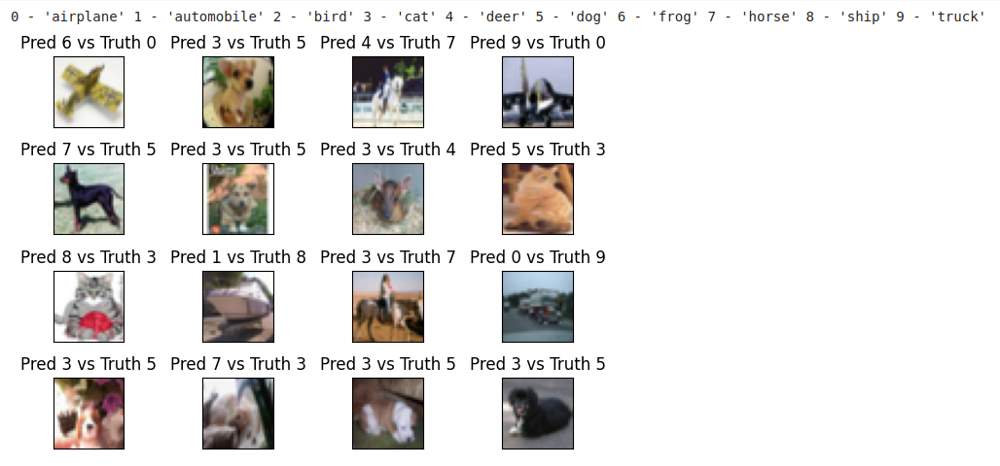

# S8 - Neural Network Image Classification - CIFAR10 DataSet
This is the repository which contains the assignment work of Session 8

## Description

This project includes 4 Python files: `model.py`, `utils.py`, data_transforms.py, dataset.py and one notebook `S8_BN_LN_GN_models.ipynb'. These files are part of a machine learning project for image classification using the CIFAR10 dataset. The project is about training a neural network model to recognize images using less than 50K parameters, and with test accuracy equal to or greater than 70% in less than 20 epochs.

Few samples in the dataset are shown below.


## Files

### 1. model.py

This file provides different neural network model architectures for image classification. This file consists of 4 new classes designed for the tasks of getting best accuracies with Batch Normalization (BN), Group Normalization (GN) and Layer Normalization (LN) - 'Net_10', 'Net_12', 'Net_13', 'Net_14', in addition the older model architectures that were designed for the tasks in S6, S7 assignments. All of these are subclasses of `torch.nn.Module` and consists of several convolution layers. These network architectures are incremental architectures meant to develop the desired model from scratch with a skeleton architecture, then reduce the model capacity to fit in the 50K parameter criteria, and then bring up model effectiveness with batch normalization, layer normalization, group normalization along with drop out. The `forward` method implements the forward pass of the model, and the `summary` method provides a summary of the model's architecture. The following shows model (Model-6 in S8_BN_LN_GN_models.ipynb) summary for 'Net_15' architecture which meets the parameter criteria for Batch Normalization, Layer Normalization, Group Normalizationand which is found to be the best architecture for the task at hand.

#### 1.1 Batch Normalization / Layer Normalization / Group Normalization Summary (Parameter Count = 37,664)
```
----------------------------------------------------------------
        Layer (type)               Output Shape         Param #
================================================================
            Conv2d-1           [-1, 32, 32, 32]             864
         GroupNorm-2           [-1, 32, 32, 32]              64
           Dropout-3           [-1, 32, 32, 32]               0
            Conv2d-4           [-1, 32, 32, 32]           9,216
         GroupNorm-5           [-1, 32, 32, 32]              64
           Dropout-6           [-1, 32, 32, 32]               0
            Conv2d-7            [-1, 8, 32, 32]             256
         MaxPool2d-8            [-1, 8, 16, 16]               0
            Conv2d-9           [-1, 32, 16, 16]           2,304
        GroupNorm-10           [-1, 32, 16, 16]              64
          Dropout-11           [-1, 32, 16, 16]               0
           Conv2d-12           [-1, 32, 16, 16]           9,216
        GroupNorm-13           [-1, 32, 16, 16]              64
          Dropout-14           [-1, 32, 16, 16]               0
           Conv2d-15           [-1, 32, 14, 14]           9,216
        GroupNorm-16           [-1, 32, 14, 14]              64
          Dropout-17           [-1, 32, 14, 14]               0
           Conv2d-18            [-1, 8, 14, 14]             256
        MaxPool2d-19              [-1, 8, 7, 7]               0
           Conv2d-20             [-1, 16, 7, 7]           1,152
        GroupNorm-21             [-1, 16, 7, 7]              32
          Dropout-22             [-1, 16, 7, 7]               0
           Conv2d-23             [-1, 16, 7, 7]           2,304
        GroupNorm-24             [-1, 16, 7, 7]              32
          Dropout-25             [-1, 16, 7, 7]               0
           Conv2d-26             [-1, 16, 7, 7]           2,304
        GroupNorm-27             [-1, 16, 7, 7]              32
          Dropout-28             [-1, 16, 7, 7]               0
        AvgPool2d-29             [-1, 16, 1, 1]               0
           Conv2d-30             [-1, 10, 1, 1]             160
================================================================
Total params: 37,664
Trainable params: 37,664
Non-trainable params: 0
----------------------------------------------------------------
Input size (MB): 0.01
Forward/backward pass size (MB): 2.17
Params size (MB): 0.14
Estimated Total Size (MB): 2.32
----------------------------------------------------------------

```
This file also has **train** and **test** functions which return the train loss, train accuracy, test loss and test accuracy respectively.

### 2. utils.py

The `utils.py` file contains helper functions that are used throughout the project. These functions provide some common functionalities for data preprocessing, visualization, or any other necessary operations. It includes functions for plotting the model train / test loss/accuracy statistics (function: **display_model_stats**), displaying the train data images (function: **show_cifar10_images**), function to obtain the samples of mis-classifications (function: **get_incorrect_test_predictions**), and function to display the mis-classified image predictions (function: **show_cifar10_incorrect_predictions**) in addition to the other helper functions which are used internally to this utils module.

### 3. data_transforms.py

The `data_transforms.py` file contains functions that perform the required image transformations and augmentations on the image data. The function **get_train_transforms** returns the transformed train data set and the function **get_test_transforms** returns the transformed test image data.

The transformations that were tried on the train and test data was just to Normalize the image data. Applying Color related transformations or random cropping of the image and then resizing back to the dimension 32,32 or center cropping of the data did not help much in obtaining the desired accuracy of 70% when LN and GN were used. However the accuracy for BN crossed 70% for these image augmentations.

### 4. dataset.py

The `dataset.py` file contains the functionality to download the train and test data set with the batch size configuration based on whether the CUDA/GPU Is available for executing the models or not. The function **download_train_data** doewnloads the train data, the function **download_test_data** downloads the test dataset and the function **get_loader** prepares and returns the train_loader and test_loader that would get finally loaded into the models. 

### 4. S8_BN_LN_GN_models.ipynb

The `S8_BN_LN_GN_models.ipynb` file is the notebook that has executions of various training models based on the network architectures Net_12, Net_13, Net_14 and Net_15 so as to execute the models right from scratch till we find the optimal model which gives 70%+ accuracy in less than 20 epochs using less than 50K parameters. 

#### 4.1. Descritpion of basic components in the notebook

This `S8_BN_LN_GN_models.ipynb`file contain code for training and evaluating a neural network model using the CIFAR10 dataset. These files include the following components:

- Importing necessary libraries and dependencies
- Mounting Google Drive
- Setting up the device (CPU or GPU)
- Defining data transformations for training and testing
- Loading the CIFAR10 dataset
- Setting up data loaders
- Displaying sample data from the training set
- Defining the neural network model and displaying its summary
- Training the model using SGD optimizer and NLL loss
- Displaying model training and testing statistics
- Displaying the incorrect test image predictions
- Defining an alternative neural network model (Model_1 to Model_9) and displaying its summary

In addition to the above components, each of these notebooks contain "Target-Results-Analysis" section for each of the models executed.

#### 4.2. Descritpion of CIFAR10 dataset

This data set consists of multiple images pertaining to 10 different classes. The following are the specifics of the 10 classes and the count of images in each of these classes.
['airplane',
 'automobile',
 'bird',
 'cat',
 'deer',
 'dog',
 'frog',
 'horse',
 'ship',
 'truck'] 

 {'frog': 5000,
 'truck': 5000,
 'deer': 5000,
 'automobile': 5000,
 'bird': 5000,
 'horse': 5000,
 'ship': 5000,
 'cat': 5000,
 'dog': 5000,
 'airplane': 5000}

#### 4.3. Findings on the Normalization Techniques tried


#### 4.4. Graphs of the Normalization Techniques tried [Best Model plots shown below]

The following model statistics for the normalization techniques tried. These plots pertain to the performance of the final optimal model using architecture Net_15 and the other model specifics are highlighted below

##### 4.4.1. Final Optimal Model Training and Test Statistics - BN

  Model-6 in S8_BN_LN_GN_models.ipynb 
  Model: Net_15, LR: 0.1, Dropout:0.05, Batch Normalization


##### 4.4.2. Final Optimal Model Training and Test Statistics - LN

  Model-6 in S8_BN_LN_GN_models.ipynb
  Model: Net_15, LR: 0.01, Dropout:0.01, Layer Normalization


##### 4.4.3. Final Optimal Model Training and Test Statistics - GN

  Model-6 in S8_BN_LN_GN_models.ipynb
  Model: Net_15, LR: 0.1, Dropout:0.01, Group Normalization, Group SIze: 2
  


#### 4.5. Collection of Mis-classified Predictions

The following image collection shows the mis-classified predictions for the normalization techniques tried. These images pertain to the preidctions made by the final optimal model (Model-6 in S8_BN_LN_GN_models.ipynb) using architecture Net_15 and the other model specifics are highlighted below


##### 4.5.1. Mis-classified Predictions (Model-6: Net_15, LR: 0.1, Dropout:0.05, Batch Normalization)


##### 4.5.2. Mis-classified Predictions (Model-6: Net_15, LR: 0.01, Dropout:0.01, Layer Normalization)



##### 4.5.3. Mis-classified Predictions (Model-6: Net_15, LR: 0.1, Dropout:0.01, Group Normalization, Group SIze: 2)


Please note that this README serves as a placeholder. As I make further modifications to the project, I would keep this file updated accordingly. 

For more detailed information on the project's implementation and code, please refer to the individual files mentioned above.

## Usage

To run the project, make sure you have the dependencies installed.
```
pip install -r requirements.txt
```
You can execute the `S8.ipynb` notebook to perform the training and testing. Adjust the hyperparameters such as learning rate, momentum, batch size, and number of epochs to improve the model performance as desired.


